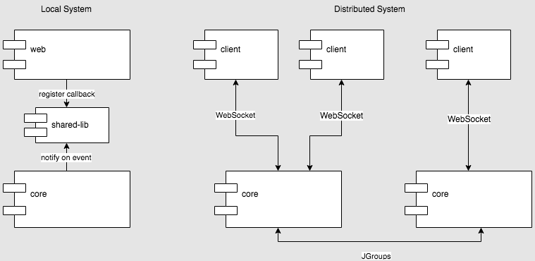

# Global Events Add-on

## Overview

The standard CUBA [Events](https://doc.cuba-platform.com/manual-latest/events.html) interface allows you to publish events that can be received by subscribers within the same application block. So there are no built-in facilities for notifying clients from middleware or propagating events in the cluster.
 
The Global Events add-on enables receiving Spring's application events on any application block of the distributed system. In the simplest configuration with `core` and `web` blocks running in a single JVM, it allows you to send events from `core` to `web` to notify UI screens or managed beans. In a cluster environment, an event published inside a block, will be received on all other connected parts of the system: on all middleware blocks and on the clients: `web` and `portal`.

In case of the client is deployed in the same JVM as middleware and `cuba.useLocalServiceInvocation` application property is set to `true`, it registers a callback in the `LocalRegistry` class located in the `shared-lib` module which is accessible to both middleware and the client.

In a distributed environment, clients open WebSocket connections to the middleware blocks, and middleware exchange events in a usual way using the cluster communication mechanism.
 


## Usage

Select a version of the add-on which is compatible with the platform version used in your project:

| Platform Version | Add-on Version |
| ---------------- | -------------- |
| 7.1.x            | 0.5.1          |
| 7.0.x            | 0.4.2          |
| 6.10.x           | 0.3.1          |
| 6.9.x            | 0.2.1          |
| 6.8.x            | 0.1.2          |

Add custom application component to your project (change the version part if needed):

`com.haulmont.addon.globalevents:cubaglevt-global:0.5.0`

Your global event classes must be inherited from `com.haulmont.addon.globalevents.GlobalApplicationEvent`, for example:

```java
package com.company.sample;

import com.haulmont.addon.globalevents.GlobalApplicationEvent;

public class MyGlobalEvent extends GlobalApplicationEvent {

    private String payload;

    public MyGlobalEvent(Object source, String payload) {
        super(source);
        this.payload = payload;
    }

    public String getPayload() {
        return payload;
    }
}
```

Make sure all fields of the event class are serializable! Also, do not ever use the `source` field to store and transfer any data, as it is transient and will not be preserved when the event is sent to another application block.

If you want to send event to Generic UI screens of connected `web` blocks, add the `GlobalUiEvent` marker interface to the event class:

```java
package com.company.sample;

import com.haulmont.addon.globalevents.GlobalApplicationEvent;
import com.haulmont.addon.globalevents.GlobalUiEvent;

public class MyUiNotificationEvent extends GlobalApplicationEvent implements GlobalUiEvent {

    private String message;

    public MyUiNotificationEvent(Object source, String message) {
        super(source);
        this.message = message;
    }

    public String getMessage() {
        return message;
    }
}
```

Send global events using the standard `Events.publish()` method, and they will be received by subscribers running on all blocks of your distributed application.

In the distributed deployment, it is recommended to suppress DEBUG log messages from `WebSocketDispatcherServlet` by adding the following line to `logback.xml`:

    <logger name="com.haulmont.addon.globalevents.core.WebSocketDispatcherServlet" level="INFO"/> 

## Features

1. Events are delivered to other blocks asynchronously, including the local deployment. 

2. Ordering is accurate only within a block.

3. Delivery in a distributed deployment is guaranteed "at most once", i.e. there is no retransmit, etc.

4. In the distributed deployment, web client opens WebSocket connection to middleware on the first browser connection. So if some `web` bean is subscribed to a global event, it will start to receive notifications only after at least one user connects to it.  

## Testing

The [global-events-demo](https://github.com/cuba-platform/global-events-demo) project contains usage examples and automatic system tests.

## Known Issues

* If messages are not received and you see in the logs the message like this: `The decoded text message was too big for the output buffer and the endpoint does not support partial messages`, see [this topic](https://www.cuba-platform.com/discuss/t/unable-to-receive-globalevent-separate-tomcat-for-app-war-app-core-war/7149) for the solution.
